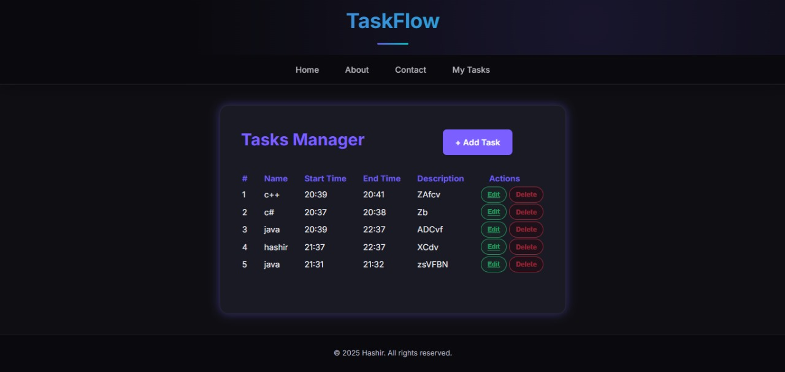
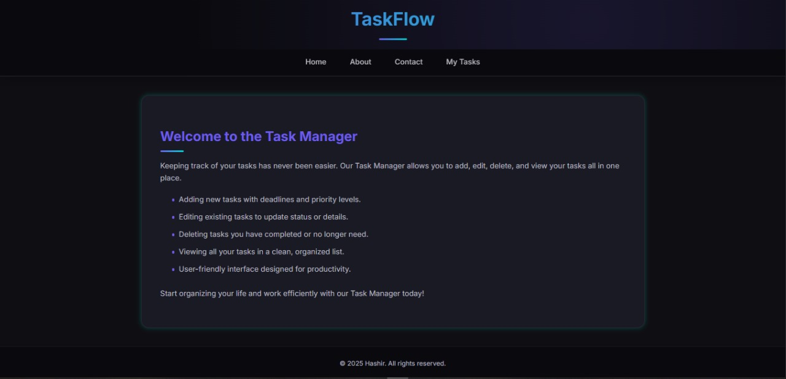

# ✅ TaskFlow – Laravel-Based Task Management System

**TaskFlow** is a powerful and intuitive task management system built using **Laravel (PHP Framework)**. It enables users to manage, track, and organize their tasks effectively with an elegant interface and secure backend.

---

## 📁 Project Structure

Task/ → Main Laravel Application  
Previews/ → UI Screenshots and Preview Images  
README.md → Project Documentation  

---

## 🚀 Key Features

- ✨ Create, Read, Update, Delete (CRUD) for Tasks
- 📝 You can add your daily routine tasks.
- ✎ Uppdate your task if any change is needed.
- 🚮 Delete tasks after they complete

---

## 🖼️ Application Preview

| Dashboard     | Task List     |
|---------------|---------------|
|  |  |


---

## 🛠️ Technology Stack

| Layer     | Technology           |
|-----------|----------------------|
| Backend   | Laravel 10+ (PHP 8+) |
| Frontend  | Blade Templating     |
| Styling   | Bootstrap 5 + CSS    |
| Database  | MySQL                |
| Tools     | Composer             |
| IDE       | VS Code              |

---

## 🏗️ Installation Guide

### ⚙️ Prerequisites

- PHP 8.1+
- Composer
- MySQL
- Laravel CLI (optional but helpful)

### 📦 Setup Instructions

```bash
# 1. Clone the repository
git clone https://github.com/hashir-zahid/TaskFlow.git

# 2. Navigate to the project
cd TaskFlow

# 3. Install PHP dependencies
composer install

# 4. Create and configure the environment file
cp .env.example .env

# 5. Generate app key
php artisan key:generate

# 6. Set up the database
php artisan migrate --seed

# 7. Serve the application
php artisan serve
